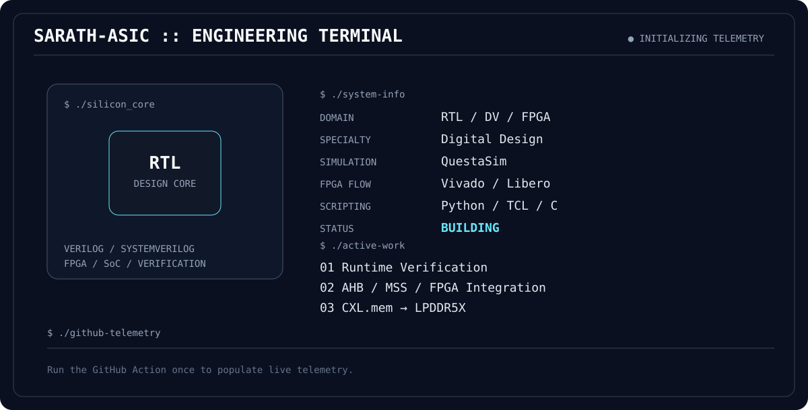

<div align="center">

# `SARATH-ASIC`
### RTL DESIGN • DESIGN VERIFICATION • FPGA • SoC



</div>

---

## `whoami`

**M.Tech VLSI Design & Embedded Systems** student focused on building and verifying digital hardware.

```text
RTL DESIGN  ───────┐
                   ├──► DIGITAL HARDWARE
DESIGN VERIFICATION┤
                   │
FPGA / SoC ────────┘
```

I enjoy projects that move beyond RTL into **simulation, assertions, coverage, integration, and implementation**.

## `current_stack`

| Area | Tools / Technologies |
|---|---|
| RTL | Verilog, SystemVerilog |
| Verification | SVA, functional coverage, QuestaSim |
| FPGA | Vivado, Libero SoC |
| Architecture | AHB, SoC / MSS integration, memory systems |
| Software | C, Python, TCL, Linux |
| Open-source flow | Yosys, Verilator, GTKWave, OpenROAD |

## `lab`

### `01` — RTL-Based Memory Accelerator
Cache-assisted memory architecture for SPI-attached systems.

```text
SPI ──► Controller ──► Cache ──► Memory
                  │
                  └──► Burst Refill
```

### `02` — Hardware-Assisted Runtime Verification
Runtime assertion monitoring + functional coverage for FPGA systems.

```text
RTL
 │
 ├──► Assertion Monitor
 ├──► Coverage Collector
 └──► Event Logger
          │
          ▼
       CPU / SoC
```

### `03` — MSS + AHB FPGA Integration
SmartFusion2 MSS / FPGA subsystem integration.

```text
CPU / MSS
    │
  FIC_0
    │
    ▼
CoreAHBLite ──► Custom AHB Slave
```

### `04` — CXL.mem → LPDDR5X
Memory-system architecture / RTL project focused on the path from a coherent memory protocol toward a modern DRAM subsystem.

## `verification`

```text
SPECIFICATION
      │
      ▼
TEST PLAN
      │
      ▼
DIRECTED TESTS ──► CORNER CASES
      │
      ▼
ASSERTIONS
      │
      ▼
FUNCTIONAL COVERAGE
      │
      ▼
DEBUG / ANALYSIS
```

Current focus:

- SystemVerilog Assertions
- Functional coverage
- Constrained-random verification
- UVM architecture
- Protocol-oriented verification
- Coverage-driven corner cases

## `engineering_log`

```text
[ RTL ]       ████████████████████░░░░
[ SVA ]       █████████████████░░░░░░
[ FPGA ]      ███████████████████░░░░
[ DV ]        ████████████████░░░░░░░
[ UVM ]       ███████████░░░░░░░░░░░
[ C / TCL ]   ███████████████░░░░░░░
```

These bars indicate current engineering/learning focus, **not formal skill scores**.

## `github_telemetry`

The dashboard is regenerated automatically by GitHub Actions. It refreshes public GitHub information such as repository count, followers, stars, recent commit activity, and the refresh timestamp.

## `connect`

**GitHub:** `@Sarath-ASIC`

```text
BUILD → SIMULATE → VERIFY → IMPLEMENT → REPEAT
```

**Hardware is not just code. It is behavior over time.**
